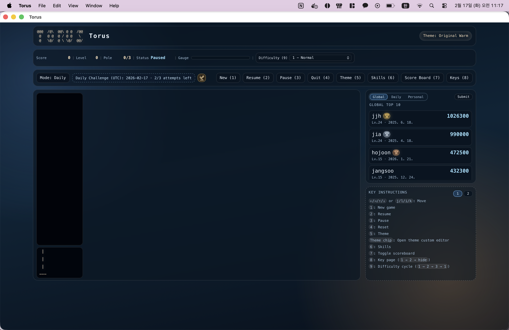

# Torus (Tauri Desktop)

<p align="center">
  
</p>

Torus is a Tauri + TypeScript desktop reimplementation of the Emacs Lisp `torus` game from the [newbiemacs project](https://github.com/jangsookim/newbiemacs).

## Download (macOS)

- Mac App Store: [T@rus](https://apps.apple.com/kr/app/t-rus/id6759029986?mt=12)

## Download (Windows)

- Latest release page: [Torus Releases](https://github.com/U-Keun/Torus/releases/latest)
- Direct installers are attached in each release asset list.

## Features

- Emacs-style ASCII torus gameplay with animated falling tori.
- Pole movement under the box, with pick/drop mechanics.
- Three difficulties:
  - `1`: Normal
  - `2`: Half-glazed + Rotate
  - `3`: Half-glazed + Flip
- Theme switching and compact single-screen desktop layout.
- Custom theme editor (click theme chip): adjust torus/text/glaze/glow colors, sample, and save locally.
- Custom one-shot `Skills` (create/run/edit/delete directional sequences, including edge-aware dynamic pair `(`/`)`).
- `GLOBAL TOP 10`, `DAILY CHALLENGE TOP 10`, and `PERSONAL TOP 10` scoreboard views.
- Own records are marked with `Me` tag in `GLOBAL` and `DAILY`.
- Daily streak badge system (`2^0` to `2^9`) based on successful consecutive Daily submissions (UTC, strict reset).
- Badge tooltip on hover (current streak, best streak, next badge progress).
- `GLOBAL` Top 3 trophy badges (`#1`, `#2`, `#3`) with animated highlight.
- Click a score row to slide open used skill details (skill name + command).
- Import skills from expanded `GLOBAL`/`DAILY` records directly into personal skill set.
- `Keys` card supports two pages: basic controls and current personal skill hotkeys/sequences.
- Optional score submission to the online leaderboard.
- Per-install UUID in Tauri backend: one online record per device, updated only when score is better.
- Local fallback cache if the network or online backend is unavailable.

## Controls

- Move: `Arrow keys` or `j/l/i/k`
- New game: `1`
- Resume: `2`
- Pause: `3`
- Reset: `4`
- Theme: `5`
- Theme custom editor: click the `Theme: ...` chip at top-right (`Apply` for preview, `Save` for persistence)
- Hover badge icon: show streak/rank details
- Skills: `6`
- Toggle scoreboard: `7`
- Key card cycle: `8` (`Page 1 -> Page 2 -> Hide -> Page 1`)
- Difficulty cycle: `9` (`1 -> 2 -> 3 -> 1`)
- Skill hotkeys: set per skill in `Skills` modal by pressing a key (duplicate registrations are blocked)

Keyboard input uses both `event.key` and `event.code`, so game controls still work in non-English IME layouts (for example Korean input mode).

## Tech Stack

- Frontend: Vite + TypeScript
- Desktop runtime: Tauri v2
- Backend commands: Rust (Tauri `invoke`)
- Online ranking: Neon Postgres served by a Neon Function compatibility API
- Local persistence: browser localStorage + Tauri app data cache

## Quick Start

### Requirements

- Node.js 20+
- Rust toolchain (stable)
- Tauri system prerequisites for macOS

### Install and run

```bash
npm install
VITE_API_BASE_URL=https://YOUR_TORUS_API_HOST npm run tauri dev
```

Omit `VITE_API_BASE_URL` to run with local-only scoreboards.

### Visual QA with Storybook

```bash
npm run storybook
```

Build a static Storybook bundle:

```bash
npm run build-storybook
```

Current UI stories cover score submission states, scoreboard views, Daily Challenge status, the key guide skills page, update/session/notice panels, and Theme/Skills modals.

### Automated tests and checks

Run the frontend unit tests once or in watch mode:

```bash
npm run test
npm run test:watch
```

Run the Rust unit tests and static checks:

```bash
cargo test --manifest-path src-tauri/Cargo.toml
cargo check --manifest-path src-tauri/Cargo.toml
npm run clippy
```

CI runs the one-shot frontend tests, frontend build, Rust tests, Cargo check, and Clippy.

### Backend configuration

Desktop builds use one public frontend variable:

```bash
VITE_API_BASE_URL=https://YOUR_TORUS_API_HOST
```

Use the `torusapi` Neon Function invocation URL without a trailing slash. This is an HTTP API base URL, not a database connection string or secret. If it is not set, online sync is disabled and the scoreboards use local-only mode.

For local development, set the variable in your shell or a local untracked Vite environment file, then run `npm run tauri dev`.

## Neon Backend Setup

The current online backend lives in [`neon/`](./neon). It stores rankings and Daily Challenge state in Neon Postgres and exposes them through a Neon Function.

1. Create a Neon project in `aws-us-east-2` (the Functions beta region).
2. Install the Neon CLI separately with `npm install -g neon@latest`.
3. In `neon/`, run `npm install` and `neon link`.
4. Apply `neon/migrations/0001_initial.sql` with the Neon SQL Editor or `psql` using the branch's unpooled migration connection.
5. Run `neon dev`, then verify the printed Function URL with `GET /health`.
6. Run `npm test` and `npm run typecheck` in `neon/`.
7. Deploy with `neon deploy`.
8. Configure desktop builds with `VITE_API_BASE_URL` set to the deployed `torusapi` invocation URL.

Neon injects `DATABASE_URL` into the Function runtime. Never expose that value, a Neon connection string, or a database password through a `VITE_*` variable.

The compatibility API keeps the existing server routes, including `/rest/v1/...` and `/functions/v1/verify-score`, so deployed clients and server behavior can migrate without a route change. Score writes require a valid replay. Daily state changes also require attempt tokens.

For more backend development and deployment details, see [`neon/README.md`](./neon/README.md).

### Legacy Supabase reference

The [`supabase/`](./supabase) directory is retained only as a legacy implementation and migration reference. It is not the current backend setup. Do not use its URL, anonymous key, Edge Function, or schema instructions for new deployments.

## Score Submission Model

- Personal records are always stored locally.
- Online submission is optional.
- Submitted scores include used skill metadata (`skill_usage`).
- Tauri backend generates and stores a UUID at first run (`device-uuid-v1.txt` in app data dir).
- Classic mode online submission:
  - Uses a single row per owner via `(mode='classic', challenge_key='classic', client_uuid)`.
  - If row does not exist: insert.
  - If row exists: update only if new score is better (or same score with higher level).
- Daily Challenge mode online submission:
  - Uses `(mode='daily', challenge_key=UTC date, client_uuid)`.
  - Daily runs are auto-submitted (no opt-out).
  - Server RPC enforces maximum 3 attempts per UTC day.
  - Client submits replay proof (seed + timed move log + final state).
  - The online backend re-simulates the run and rejects mismatched score/level/time.
  - `attempts_used` increments even when score does not improve.
  - If submission is rejected before accept (e.g. verify/token error), the client rolls back that attempt charge.
  - When daily best improves, that run is also auto-submitted to classic Global (same best-upsert rule).
  - `scores` keeps only today's Daily rows.
  - Daily streak state is kept in `daily_streak_states` (`current_streak`, `max_streak`, `last_submission_key`).
  - Badge tier is derived from stored `max_streak`.

This prevents duplicate classic entries and makes daily attempt limits tamper-resistant.

## Build

```bash
npm run build
cargo check --manifest-path src-tauri/Cargo.toml
```

## Project Structure

- `src/main.ts`: app bootstrap and UI/event wiring
- `src/game.ts`: game loop and mechanics
- `src/scoreboard.ts`: local/global scoreboard store abstraction
- `src/ui/layout.ts`: DOM template and bindings
- `src/ui/renderer.ts`: rendering logic (playfield, HUD, cards)
- `src/ui/theme.ts`: theme handling
- `src-tauri/src/scoreboard.rs`: backend fetch/submit/cache/UUID logic
- `neon/`: current Neon database migration and Function backend
- `supabase/`: legacy backend reference only
